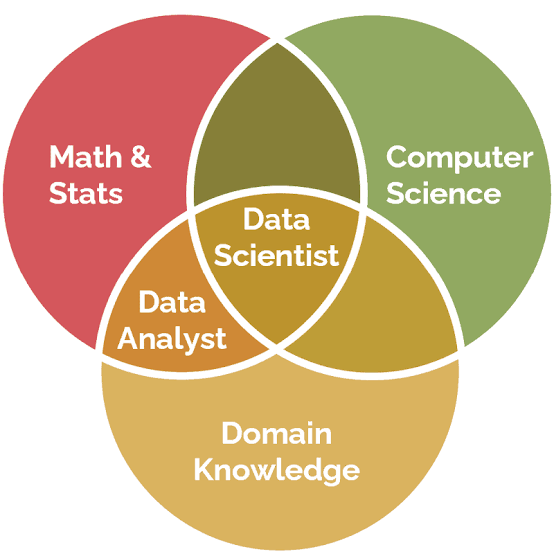

# Markdown Language Assignment - 01

**Name:** Rimsha Mukhtiar  
**Roll No:** MSDSF26M002  
**Instructor:** Dr. Muhammad Nadeem Majeed  
**Subject:** [**Tools and Techniques for Data Science**](https://classroom.google.com/u/1/c/ODI2MjgzMjI3NzU1)

---

# Part A — About Me

My name is **Rimsha Mukhtiar**, and I am currently studying **MS Data Science** in my *1st semester* at **Punjab University, Lahore**. I am from **Lahore**, which is also my hometown and the city where I am continuing my studies. My main interests are *programming, reading, and outing*. I enjoy learning new things about technology and improving my programming skills. I am learning Data Science because I am interested in understanding how data can be used to solve real-world problems and help people make better decisions. During my studies, I am exploring different technologies and learning how to work with data using tools such as `Python`, `Pandas`, and `NumPy`. I believe Data Science is an interesting field because it combines programming, mathematics, and problem-solving. My future career goal is to become a **Data Scientist** and develop strong skills in data analysis, machine learning, and data visualization. I hope my studies will help me build useful projects and prepare me for a successful career in the field of Data Science.

---
# Part B — My Technology Skills

| Technology | My Level     | Experience                                          | I Use It For                                          |
| ---------- | ------------ | --------------------------------------------------- | ----------------------------------------------------- |
| Python     | Intermediate | Used for small learning tasks and practice programs | Programming, data processing, and basic analysis      |
| NumPy      | Intermediate | Used for practice and small data tasks        | Numerical calculations and working with arrays        |
| Pandas     | Basic | Used for small data analysis tasks                  | Data cleaning, manipulation, and analysis             |
| Excel      | Intermediate | Used for practice and small data tasks              | Organizing data, calculations, and basic analysis     |
| SQL        | Intermediate | Used while learning database concepts               | Writing queries and retrieving data                   |
| Power BI   | Basic | Used for small practice tasks                       | Creating dashboards and data visualizations           |
| Matplotlib | Basic |  Used for visualization tasks             | Creating graphs and charts                            |
| Seaborn    | Basic | Used for small visualization tasks                  | Statistical data visualization and exploring datasets |

---
# Part C — My Learning Journey

1. Started learning programming basics.
2. Learned Python fundamentals.
3. Created my first simple Python programs.
4. Started working with NumPy.
5. Learned Pandas for data handling.
6. Started learning SQL.
7. Practiced data tasks using Excel.
8. Learned the basics of Power BI.

### My Learning Areas

* **Programming**

  * Python
  * Programming Basics

* **Data Handling**

  * NumPy
  * Pandas
  * Excel
  * SQL

* **Data Visualization**

  * Power BI
  * Matplotlib
  * Seaborn

---
# Part D — My Favorite Technologies

### 1. Python

* **Why I like it:** Python is easy to understand and useful for Data Science.
* **Where I have used it:** I have used Python for small programming and learning tasks.
* **Online Resource:** [W3Schools Python Tutorial](https://www.w3schools.com/python/)

### 2. SQL

* **Why I like it:** SQL is useful for working with databases and retrieving data.
* **Where I have used it:** I have practiced SQL queries during my learning.
* **Online Resource:** [SQL Tutorial](https://www.youtube.com/watch?v=hlGoQC332VM)

### 3. Excel

* **Why I like it:** Excel is simple and useful for organizing and analyzing data.
* **Where I have used it:** I have used Excel for small data-related tasks.
* **Online Resource:** [Excel Tutorial](https://www.youtube.com/watch?v=Zr0sNpeClV4)

### 4. NumPy

* **Why I like it:** NumPy makes numerical calculations and data operations easier.
* **Where I have used it:** I have practiced NumPy during my learning.
* **Online Resource:** [NumPy Tutorial](https://www.youtube.com/watch?v=9DhZ-JCWvDw)

### 5. Pandas

* **Why I like it:** Pandas is useful for handling and analyzing datasets.
* **Where I have used it:** I have used Pandas for small data analysis tasks while learning.
* **Online Resource:** [Pandas Tutorial](https://www.youtube.com/watch?v=qrMnoY8qBJM)

---
# Part E — Project Checklist

### Planned Project

**Project Topic:** Degree–Job Mismatch Analysis

I have recently reviewed the project idea and explored the available data. I am planning to select this topic for my course project. The actual project work has not started yet.

### Project Progress

- [x] Reviewed and explored the project topic
- [x] Reviewed the available dataset
- [x] Selected project topic
- [ ] Downloaded dataset
- [ ] Cleaned dataset
- [ ] Started analysis
- [ ] Created visualizations
- [ ] Started report
- [ ] Completed project

---
# Part F — Mathematical Expressions

### Mean

`Mean = Σx / n`

### Accuracy

`Accuracy = (TP + TN) / (TP + TN + FP + FN)`

---
# Part G — Blockquotes

> "The beautiful thing about learning is that nobody can take it away from you." — B.B. King

> "Programs must be written for people to read, and only incidentally for machines to execute." — Harold Abelson

---
# Part H — Data Science Image

---
# Part I — Markdown Features I Practiced

- [x] Headings
- [x] Bold
- [x] Italic
- [x] Inline Code
- [x] Ordered List
- [x] Unordered List
- [x] Nested List
- [x] Links
- [x] Images
- [x] Tables
- [x] Blockquotes
- [x] Mathematical Expressions
- [x] Checklist
- [ ] Strikethrough
- [ ] Horizontal Rule
---
